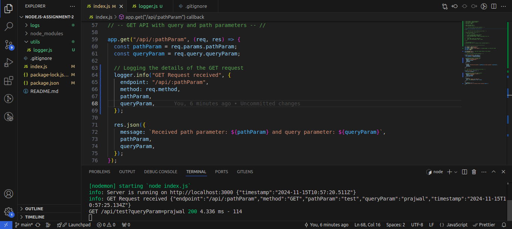
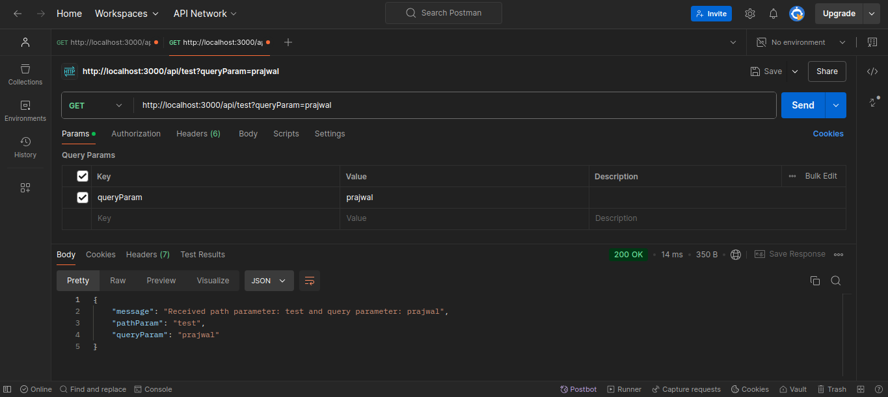
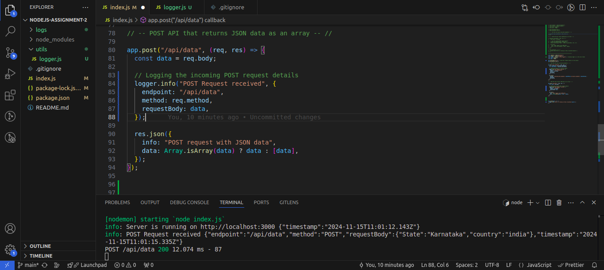
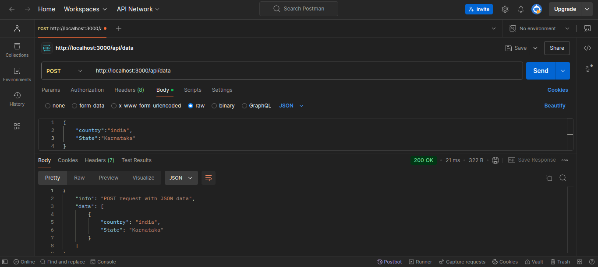

# Screenshots of the logs and Postman response.

**1) This screenshots describes the log for the GET Request.**
**http://localhost:3000/api/:pathParam**

**This screenshots describes the Postman response for the Above Request.**

**2) This screenshots describes the log for the POST Request.**
**http://localhost:3000/api/data**

**This screenshots describes the Postman response for the Above Request.**

